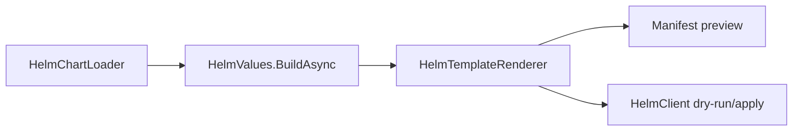

# API Overview

Start with the workflow, then choose the smallest package. The detailed member index lives under [API Reference](api/index.md); this page is the decision guide.

::: warning Version availability
1.2.0 is the latest published version. The M2 request objects and distribution workflows on this page are available in the 1.2.0 NuGet packages.
:::

## Package decision table

| You want to... | Start with | Next page |
| --- | --- | --- |
| Render manifests only | `HelmSharp.Chart` + `HelmSharp.Engine` | [First Render](guide/first-render.md) |
| Build a preview API | `HelmSharp.Chart` + `HelmSharp.Engine` | [Render Preview API](examples/render-preview-api.md) |
| Offer dry-run and apply | `HelmSharp.Action` | [Release Workflows](guide/release-workflows.md) |
| Apply already-rendered YAML | `HelmSharp.Kube` | [Kubernetes Operations](guide/kubernetes-operations.md) |
| Manage release history directly | `HelmSharp.Release` | [Release package](packages/release.md) |
| Search or pull from chart repos | `HelmSharp.Repo` | [Repo package](packages/repo.md) |
| Package, publish, or restore dependencies | `HelmSharp.Action` + `HelmSharp.Repo` | [Chart Distribution](guide/chart-distribution.md) |

## Core workflow shape



## Most-used public types

| Type | Package | Use |
| --- | --- | --- |
| `HelmClient` | `HelmSharp.Action` | Command-like facade for template and release operations. |
| `HelmTemplateRequest` | `HelmSharp.Action` | Render request for high-level previews. |
| `HelmUpgradeInstallRequest` | `HelmSharp.Action` | Install/upgrade request, including dry-run. |
| `IHelmOptionsProvider` | `HelmSharp.Action` | Centralize environment defaults. |
| `HelmChartLoader` | `HelmSharp.Chart` | Load a chart directory or archive. |
| `HelmValues` | `HelmSharp.Chart` | Merge chart defaults and overrides. |
| `HelmTemplateRenderer` | `HelmSharp.Engine` | Render manifests and NOTES. |
| `KubernetesManifestApplier` | `HelmSharp.Kube` | Apply/delete rendered manifests. |

## Operation request objects

For package, pull, repository index, and dependency workflows, prefer request-object overloads in new code. Existing convenience overloads remain available and route through the same implementations.

```csharp
using HelmSharp.Action;
using HelmSharp.Repo;

await client.PackageAsync(new HelmPackageRequest
{
    ChartPath = "./charts/app",
    Destination = "./artifacts",
    Version = "1.2.0"
});

await client.PullAsync(new HelmPullRequest
{
    ChartReference = "app",
    Version = "~1.2.0",
    RepositoryUrl = "https://charts.example.com"
});

await client.RepoIndexAsync(new HelmRepoIndexRequest
{
    DirectoryPath = "./artifacts",
    Url = "https://charts.example.com",
    MergeIndexPath = "./previous-index.yaml"
});

await client.DependencyUpdateAsync(new HelmDependencyUpdateRequest
{
    ChartPath = "./charts/app",
    RepositoryConfigPath = "./helm/repositories.yaml",
    RepositoryCachePath = "./helm/cache"
});
```

Pull credentials are limited to the repository origin by default. Set `PassCredentialsAll = true` only when a trusted index intentionally serves chart archives from another authenticated origin.

The request types make defaults explicit and leave room for M2 behavior without adding more optional parameters to `IHelmClient`.

For complete package, index, pull, update, and build examples, see [Chart Packaging and Repository Workflows](guide/chart-distribution.md).

## Generated API reference

The generated reference lists public types, properties, and methods by package:

- [Action API](api/generated/action.md)
- [Chart API](api/generated/chart.md)
- [Engine API](api/generated/engine.md)
- [Kube API](api/generated/kube.md)
- [Release API](api/generated/release.md)
- [Repo API](api/generated/repo.md)

## Error handling model

High-level `HelmClient` operations return `CommandResult`. Lower-level loading, values, and rendering APIs throw .NET exceptions when they cannot load, parse, or evaluate input. See [Error Handling](guide/error-handling.md).
