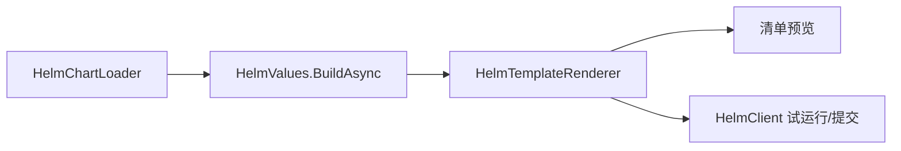

# API 选择

先看工作流，再选最小包。详细成员索引在 [API 参考](api/index.md)，本页用于决策。

## 包选择表

| 你想做什么 | 起点 | 下一页 |
| --- | --- | --- |
| 只渲染清单 | `HelmSharp.Chart` + `HelmSharp.Engine` | [第一次渲染](guide/first-render.md) |
| 构建预览 API | `HelmSharp.Chart` + `HelmSharp.Engine` | [渲染预览 API](examples/render-preview-api.md) |
| 提供试运行和提交 | `HelmSharp.Action` | [发布工作流](guide/release-workflows.md) |
| 提交已渲染 YAML | `HelmSharp.Kube` | [Kubernetes 操作](guide/kubernetes-operations.md) |
| 直接管理发布历史 | `HelmSharp.Release` | [Release 包](packages/release.md) |
| 搜索或拉取 Chart 仓库 | `HelmSharp.Repo` | [Repo 包](packages/repo.md) |
| 打包、发布或恢复依赖 | `HelmSharp.Action` + `HelmSharp.Repo` | [Chart 分发](guide/chart-distribution.md) |

## 核心工作流形态



## 最常用公开类型

| 类型 | 包 | 用途 |
| --- | --- | --- |
| `HelmClient` | `HelmSharp.Action` | 类命令门面，覆盖模板渲染和发布操作。 |
| `HelmTemplateRequest` | `HelmSharp.Action` | 高层预览渲染请求。 |
| `HelmUpgradeInstallRequest` | `HelmSharp.Action` | 安装/升级请求，包括试运行。 |
| `IHelmOptionsProvider` | `HelmSharp.Action` | 集中管理环境默认值。 |
| `HelmChartLoader` | `HelmSharp.Chart` | 加载 Chart 目录或归档。 |
| `HelmValues` | `HelmSharp.Chart` | 合并 Chart 默认值和覆盖项。 |
| `HelmTemplateRenderer` | `HelmSharp.Engine` | 渲染清单和 NOTES。 |
| `KubernetesManifestApplier` | `HelmSharp.Kube` | 提交/删除渲染后的清单。 |

## 操作请求对象

新代码执行打包、拉取、仓库索引和依赖工作流时，建议使用请求对象重载。现有便捷重载会继续保留，并转发到相同实现。

```csharp
using HelmSharp.Action;
using HelmSharp.Repo;

await client.PackageAsync(new HelmPackageRequest
{
    ChartPath = "./charts/app",
    Destination = "./artifacts",
    Version = "1.2.0"
});

await client.PullAsync(new HelmPullRequest
{
    ChartReference = "app",
    Version = "~1.2.0",
    RepositoryUrl = "https://charts.example.com"
});

await client.RepoIndexAsync(new HelmRepoIndexRequest
{
    DirectoryPath = "./artifacts",
    Url = "https://charts.example.com",
    MergeIndexPath = "./previous-index.yaml"
});

await client.DependencyUpdateAsync(new HelmDependencyUpdateRequest
{
    ChartPath = "./charts/app",
    RepositoryConfigPath = "./helm/repositories.yaml",
    RepositoryCachePath = "./helm/cache"
});
```

拉取凭据默认仅发送到仓库同源地址。只有当可信索引确实从另一个需要认证的来源提供 Chart 归档时，才设置 `PassCredentialsAll = true`。

这些请求类型明确表达默认值，也为 M2 行为留出扩展空间，避免继续向 `IHelmClient` 增加可选参数。

完整的打包、索引、拉取、更新和构建示例见 [Chart 打包与仓库工作流](guide/chart-distribution.md)。

## 生成 API 参考

生成参考按包列出公开类型、属性和方法：

- [Action API 参考](api/generated/action.md)
- [Chart API 参考](api/generated/chart.md)
- [Engine API 参考](api/generated/engine.md)
- [Kube API 参考](api/generated/kube.md)
- [Release API 参考](api/generated/release.md)
- [Repo API 参考](api/generated/repo.md)

## 错误处理模型

高层 `HelmClient` 操作返回 `CommandResult`。低层加载、values 和渲染 API 在无法加载、解析或求值时抛出 .NET 异常。详见 [错误处理](guide/error-handling.md)。
