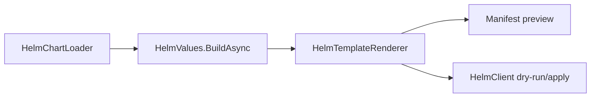

# API 选择

先看工作流，再选最小包。详细成员索引在 [API 参考](api/index.md)，本页用于决策。

## 包选择表

| 你想做什么 | 起点 | 下一页 |
| --- | --- | --- |
| 只渲染 manifests | `HelmSharp.Chart` + `HelmSharp.Engine` | [第一次渲染](guide/first-render.md) |
| 构建预览 API | `HelmSharp.Chart` + `HelmSharp.Engine` | [渲染预览 API](examples/render-preview-api.md) |
| 提供 dry-run 和 apply | `HelmSharp.Action` | [发布工作流](guide/release-workflows.md) |
| Apply 已渲染 YAML | `HelmSharp.Kube` | [Kubernetes 操作](guide/kubernetes-operations.md) |
| 直接管理 release history | `HelmSharp.Release` | [Release 包](packages/release.md) |
| 搜索或拉取 Chart repo | `HelmSharp.Repo` | [Repo 包](packages/repo.md) |

## 核心工作流形态

## 最常用公开类型

| 类型 | 包 | 用途 |
| --- | --- | --- |
| `HelmClient` | `HelmSharp.Action` | 类命令 facade，覆盖 template 和 release 操作。 |
| `HelmTemplateRequest` | `HelmSharp.Action` | 高层预览渲染请求。 |
| `HelmUpgradeInstallRequest` | `HelmSharp.Action` | Install/upgrade 请求，包括 dry-run。 |
| `IHelmOptionsProvider` | `HelmSharp.Action` | 集中管理环境默认值。 |
| `HelmChartLoader` | `HelmSharp.Chart` | 加载 Chart 目录或归档。 |
| `HelmValues` | `HelmSharp.Chart` | 合并 Chart 默认值和覆盖项。 |
| `HelmTemplateRenderer` | `HelmSharp.Engine` | 渲染 manifests 和 NOTES。 |
| `KubernetesManifestApplier` | `HelmSharp.Kube` | Apply/delete 渲染后的 manifests。 |

## 生成 API 参考

生成参考按包列出公开类型、属性和方法：

- [Action API](api/generated/action.md)
- [Chart API](api/generated/chart.md)
- [Engine API](api/generated/engine.md)
- [Kube API](api/generated/kube.md)
- [Release API](api/generated/release.md)
- [Repo API](api/generated/repo.md)

## 错误处理模型

高层 `HelmClient` 操作返回 `CommandResult`。低层加载、values 和渲染 API 在无法加载、解析或求值时抛出 .NET exception。详见 [错误处理](guide/error-handling.md)。
